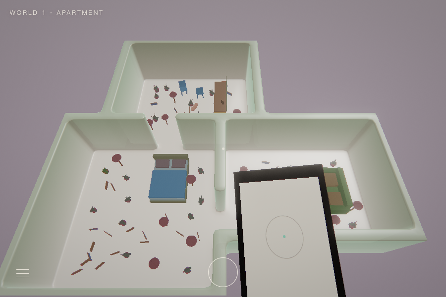
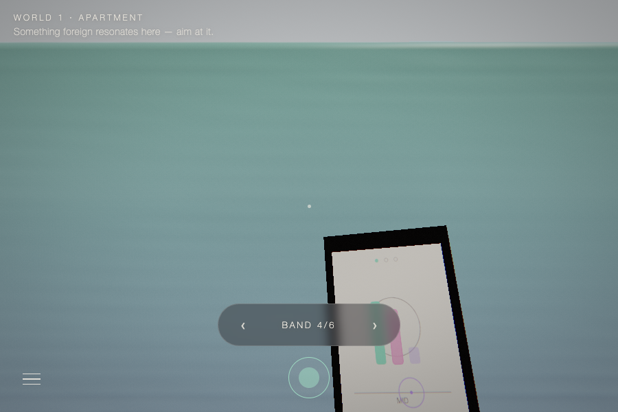
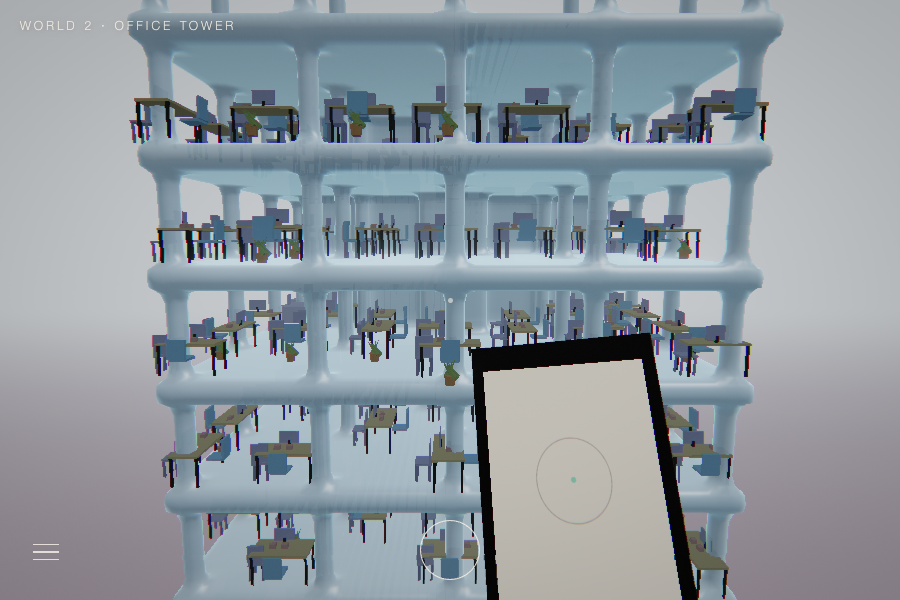
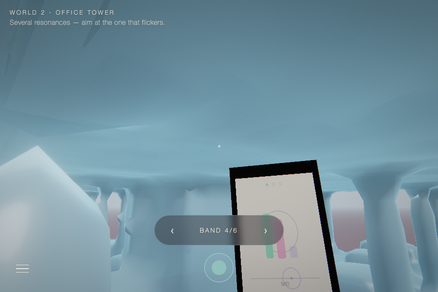
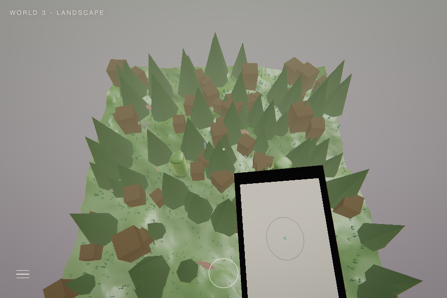
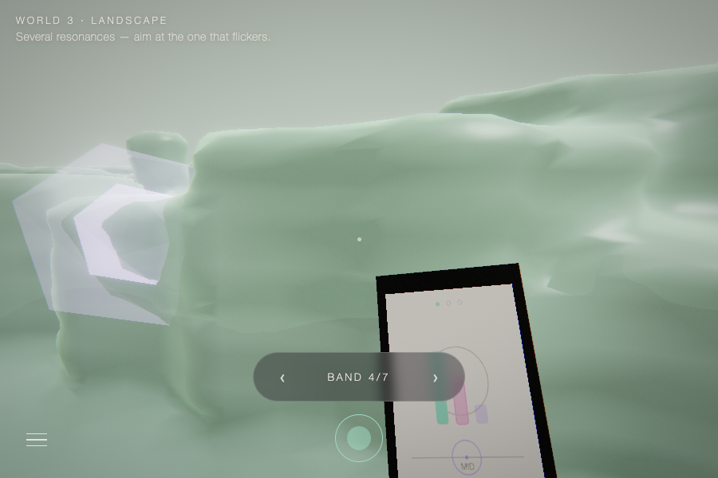
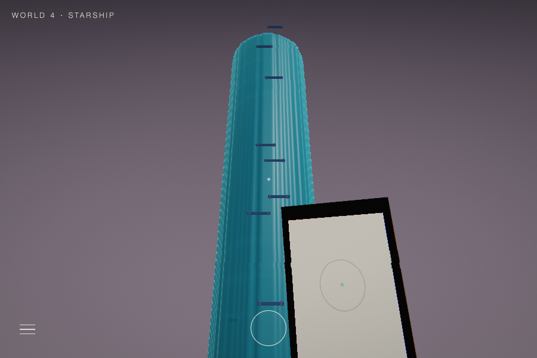
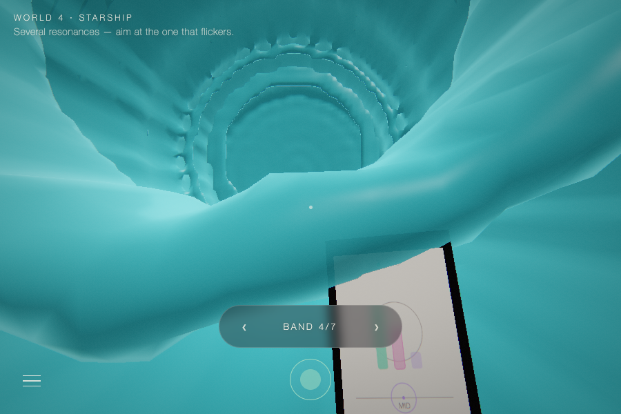
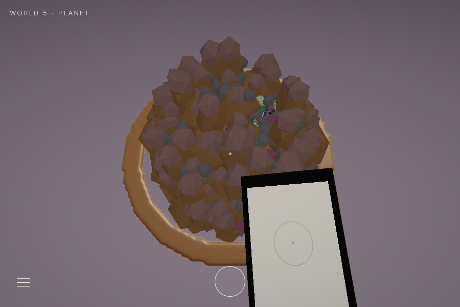
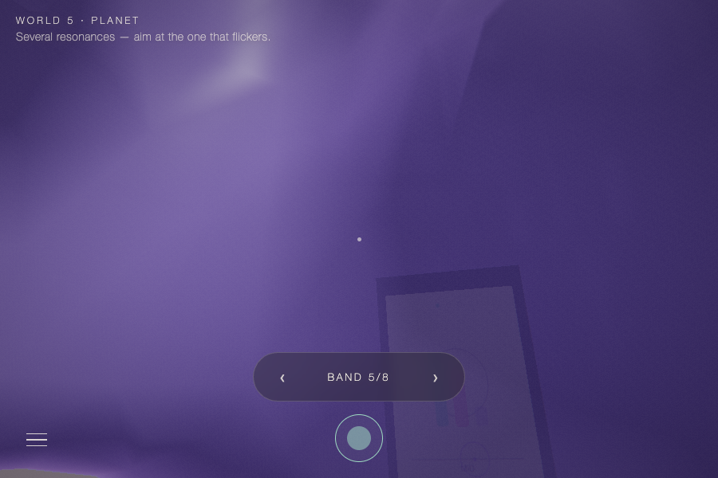

# Environment screenshots

A minimalist reference set for each procedural environment, in two views:

- **`birdseye-*`** — the bird's-eye *establishing shot*: the populated place
  (walls/floor/terrain shell + thousands of instanced objects) framed from above
  so the layout reads at a glance.
- **`planning-*`** — the *spectral planning* view: the same world after the
  Fourier transform, navigated as a band-limited inverse-FFT isosurface (where
  the hidden anomaly is hunted).

| # | Environment | Bird's-eye | Planning (spectral) |
|---|-------------|-----------|---------------------|
| 1 | Apartment   |    |    |
| 2 | Office Tower |  |  |
| 3 | Landscape   |    |    |
| 4 | Starship    |     |     |
| 5 | Planet      |       |       |

Regenerate with `node tools/envshots.mjs` (needs the dev server running).
